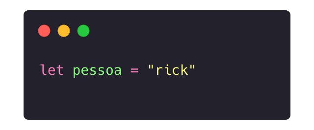
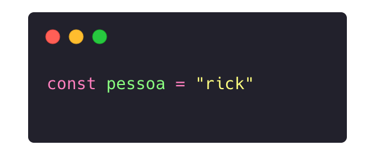
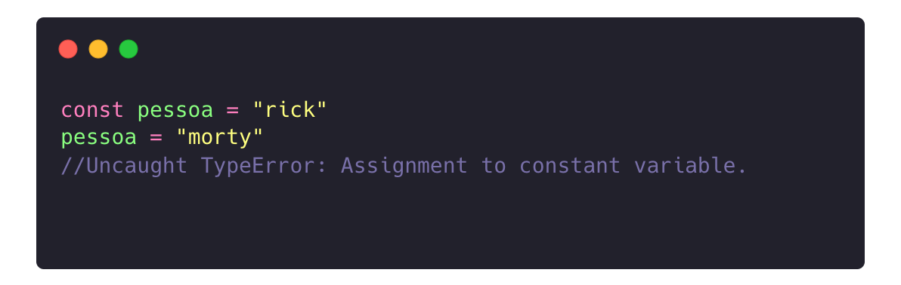
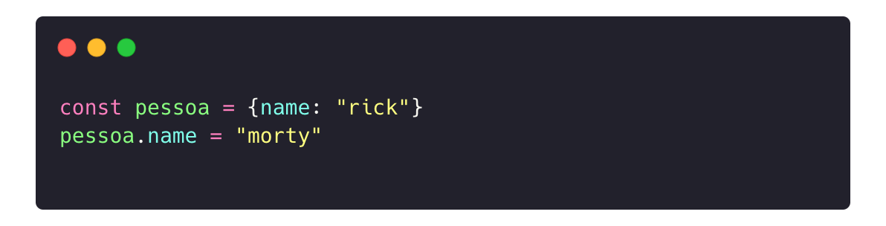

# O que é Node
* Plataforma
  * v8
  * Acesso a hardware (hd, rede, ...)
* Javascript
  * Linguagem
  * ECMA
* Alternativa
  * Deno

---

# Tipos

* number
* string
* boolean
* object
  * Sim, arrays são objects
* function
* undefined
* null
* NaN

---

# Variáveis

## Var

## Let

## Const</const>

---

# Porque const?

## Vazamento de escopo !

---

# Porque const?

## Isso não funciona

---

# Porque const?

## Mais isso sim

---

# Controle

* `if`
* `for`
* `forEach`
* `map`
* `reduce`
* `filter`
* ...

---

# Maluquices

* Operações entre tipos distintos
* Converções automáticas
* Vazamento de escopo
  `var`, `let` e `const`

---

# Definindo Funções

* Long way
* Short way
* Shorter

---

# Funções de Outro Arquivo

* `require`
* `modules.export`

---

# Multiparadigma

- OO
- Script (obviamente)
- Functional aproach

---

# Quase OO

* Definindo uma classe
* Construtor
* Métodos
* Herança <-
* Interfaces???
  * No!

---

# Quase Functional

* Firstclas functions
* Funções puras
* Reduzindo acoplamento
* Imutabilidade???
  * No!

---

# Assincrono

---

# Dependências

> NPM node package manager

---

# Lets que Lets

> Vamos construir uma API

